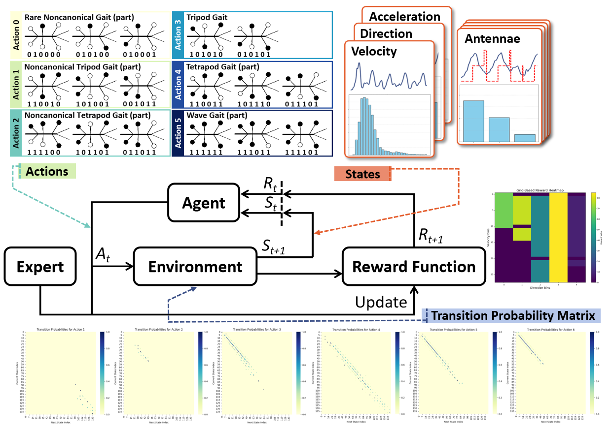

# Gait Strategy Encoding via Inverse Reinforcement Learning

This project focuses on modeling and encoding the gait strategies of stick insects using Maximum Entropy Inverse Reinforcement Learning (MaxEnt-IRL). The goal is to infer the underlying reward structures that govern gait pattern selection during walking, based on observed kinematic and sensory information.

Parts of this work will be presented at the:
- **AMAM2025 (The 12th International Symposium on Adaptive Motion of Animals and Machines and 2nd LokoAssist Symposium)**.  

A related journal submission to **Bioinspiration & Biomimetics** is currently under review.

## Introduction

Locomotion in stick insects involves complex gait strategies that dynamically adapt to environmental feedback. This project applies Maximum Entropy Inverse Reinforcement Learning to uncover the reward structure underlying gait selection, based on a set of observed state variables and discrete gait patterns.

- **States**: Walking dynamics parameters and antennae sensory information.
    - ***Walking dynamics parameters***: Velocity, acceleration, and walking direction are discretized via uniform binning to construct a finite discrete state space.
    - ***Antennae sensory information***: Processed by smoothing and measuring the time elapsed since the most recent minimum within each joint cycle, followed by discretization using uniform binning.
- **Actions**: Discrete gait patterns identified from locomotion trajectories, including both canonical gaits and noncanonical gaits.
- **Transition Probabilities**: State-action-state transitions are collected from demonstration trajectories to construct an empirical transition probability matrix, representing the observed dynamics of gait pattern changes conditioned on the discretized states.
- **Objective**: Learn a reward function that best explains the observed gait behaviors under the maximum entropy principle by matching expected feature counts between expert trajectories and learned policies.

This project uses the stick insect walking dataset from an open-access database: [Stick Insect Locomotion](https://pub.uni-bielefeld.de/record/2639454#details)

## Maximum Entropy Inverse Reinforcement Learning (MaxEnt-IRL)

Maximum Entropy Inverse Reinforcement Learning (MaxEnt-IRL) is a framework for learning reward functions from expert demonstrations under the principle of maximum entropy.  
Rather than assuming the expert always selects the optimal action, MaxEnt-IRL models the expert behavior as stochastic, preferring actions that are exponentially more likely when they lead to higher rewards.

Key characteristics of MaxEnt-IRL:
- **Stochasticity**: Expert demonstrations are modeled probabilistically, capturing the natural variability in biological behaviors.
- **Feature Matching**: The algorithm optimizes the reward function so that the expected feature counts under the learned policy match those observed in the expert data.
- **Maximum Entropy Principle**: Among all possible distributions that match the feature expectations, the one with the maximum entropy (i.e., the most uncertainty) is selected to avoid unjustified assumptions.

After inferring the reward function through MaxEnt-IRL, policy learning is performed using tabular Q-learning.

- **State-Action Value Estimation**:  
  Q-learning iteratively updates the state-action value function (Q-values) by interacting with the environment modeled through the empirical transition probability matrix.

- **Bellman Equation Update**:  
  The Q-values are updated to satisfy the Bellman optimality equation, using the inferred reward as the immediate reward signal:
  \[
  Q(s, a) \leftarrow Q(s, a) + \alpha \left( r(s, a) + \gamma \sum_{s'} P(s'|s,a) \max_{a'} Q(s',a') - Q(s,a) \right)
  \]
  where:
  - \( \alpha \) is the learning rate
  - \( \gamma \) is the discount factor
  - \( P(s'|s,a) \) is the transition probability from state \( s \) to \( s' \) under action \( a \)

- **Policy Extraction**:  
  Once the Q-values converge, the optimal policy is derived by selecting the action with the highest Q-value for each state:
  \[
  \pi^*(s) = \arg\max_a Q(s,a)
  \]

## Experiments

Three different experimental settings are designed to evaluate the influence of different state representations on gait strategy learning:

1. **Velocity + Direction (Vel-Dir)**  
   - Script: `python train_dirvel_gait.py`
   - State input: Walking velocity and heading direction.

2. **Velocity + Acceleration (Vel-Acc)**  
   - Script: `python train_velacc_gait.py`
   - State input: Walking velocity and acceleration.

3. **Antennae Information (AG)**  
   - Script: `python train_AG.py`
   - State input: Antennae sensory signals (from four antennae joints).

The code supports three modes:

- **train**: Train the reward function using Maximum Entropy Inverse Reinforcement Learning (MaxEnt-IRL) and save the reward functions. 

- **evaluate**: Evaluate the learned reward function and recover the optimal policy using Q-learning.

- **test**: Run policy and compare it against the expert demonstration data.

Change the mode in the configuration file: `configs/irl.yml`